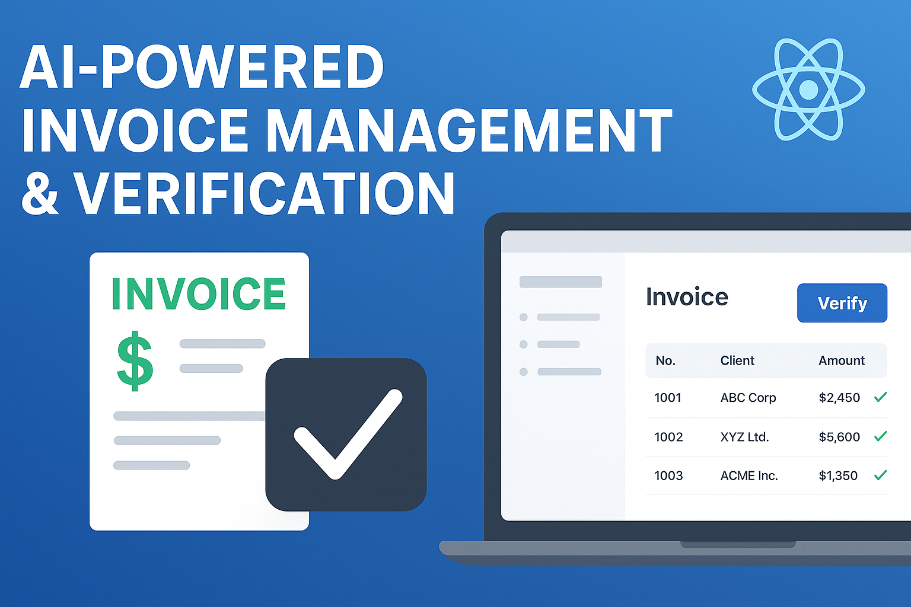
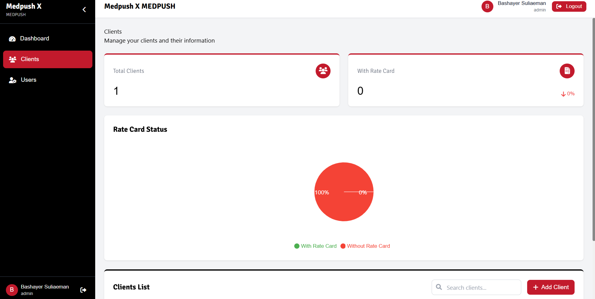

# 🚀 AI-Powered Invoice Approval System

A comprehensive **AI-based document verification and invoice approval system** designed to automate manual workflows—significantly reducing human error and accelerating processing time for client-agency financial cycles.

---

## 📋 Problem & Goal: Automating Finance for Bashayer

The traditional invoice approval process for **Bashayer (Riyadh, Saudi Arabia)** faced severe inefficiencies that threatened scalability:

* **Manual Processing Bottleneck:** Every invoice, quotation, and supporting document required time-intensive human review.
* **Error-Prone Verification:** Reviewers frequently missed subtle inconsistencies or miscalculations, leading to financial inaccuracies.
* **Scalability Issues:** The growing volume of documents from an expanding client and agency base made manual processing unsustainable.
* **Disorganized Document Handling:** Six distinct document types had to be manually matched and cross-verified for every single transaction.

🎯 **Goal:** Design and deploy an intelligent, end-to-end system to **process, extract, and verify invoice data automatically** while offering a secure, user-friendly digital approval interface.

---

## 💡 Solution Overview

An end-to-end **AI-powered invoice verification system** integrating intelligent document processing, a unified dashboard, and a scalable cloud-agnostic infrastructure.



---

## 🧠 1. AI Extraction Pipeline: Intelligent Document Processing

**Challenge:** Accurately extract and cross-validate data from diverse, multi-format documents (PDF, Excel, scanned images).

**Solution:** Built a high-performance AI pipeline utilizing **Google Gemini API** for advanced document understanding, orchestrated via a **FastAPI** backend.

**Key Capabilities:**
* **Accurate Field Extraction:** Extracts critical fields like invoice number, total amount, date, agency code, and job order ID.
* **Cross-Document Validation:** Automatically verifies consistency between the Invoice, Approved Quotation, and Timesheet documents.
* **Discrepancy Detection:** Flags and highlights any miscalculations or mismatches between source documents.
* **Format Flexibility:** Seamlessly handles structured and unstructured data across multiple file formats.

**Tech Stack:** `Python`, `FastAPI`, `Gemini API`, `PyPDF`, `Pandas`


---

## 🖥️ 2. User Interface: Unified Approval Dashboard

**Challenge:** Create an intuitive, multi-role interface that streamlines the review and approval process for all stakeholders.

**Solution:** Developed a modern, responsive dashboard using **Next.js 15, React, and TailwindCSS**, connected to the FastAPI API.

**Highlights:**
* **Intuitive Upload:** Drag-and-drop file upload with real-time AI processing feedback.
* **Organized View:** Folder system groups all six required document types per agency for comprehensive review.
* **Review Panel:** Side-by-side comparison of AI-extracted data versus the original document view.
* **Role-Based Access:** Customized user experience for **Admin, Reviewer, and Agency** roles.



---

## 📊 3. Analytics & Monitoring

**Challenge:** Provide real-time visibility into process efficiency and system accuracy.

**Solution:** Integrated an analytics dashboard to track and report key performance indicators.

**Features:**
* **Processing Metrics:** Real-time statistics for processed vs. pending invoices.
* **Efficiency Tracking:** Daily and monthly approval rates and cycle times.
* **Accuracy Improvement:** Monitoring of AI validation accuracy over time.
* **Performance Summaries:** Agency-wise breakdown of volume and efficiency.


---

## ☁️ 4. Scalable Infrastructure & CI/CD

**Challenge:** Ensure a highly scalable, available, and cloud-agnostic deployment with continuous quality assurance.

### Deployment & Infrastructure
Architected a modular system using industry-standard tools, designed for portability and high availability.
* **Storage:** `AWS S3` for secure and scalable document storage.
* **Compute:** `AWS EC2` for hosting the FastAPI backend and Next.js frontend.
* **Database:** `MongoDB Atlas` (or RDS option) for flexible data persistence.
* **Portability:** Fully **Dockerized Setup** ensures the application can be seamlessly moved to any cloud provider (Google Cloud, Azure).

### Continuous Integration / Continuous Delivery (CI/CD)
Implemented a robust pipeline for reliable, fast, and consistent releases.
* **Quality Gates:** Automated linting and unit tests run on every code push.
* **Automation:** Build and deployment automation to staging and production environments.
* **Safety:** Rollback mechanisms for secure and immediate updates.

---

## 🔒 Security Features

Security was integrated at every layer of the architecture to protect sensitive financial data.

* **Authentication:** Secure **JWT** (JSON Web Token) authentication for all API endpoints.
* **Access Control:** Strict **Role-based access (RBAC)** ensures users only see and interact with data relevant to their role (Admin, Reviewer, Agency).
* **Validation:** Comprehensive file type and size validation on upload.
* **Protection:** Environment variable encryption and **API rate limiting** to prevent abuse.

---

## 🏗️ System Architecture & Document Flow

### Core Flow
Document Upload $\rightarrow$ AI Processing Pipeline (`Gemini API` + `FastAPI`) $\rightarrow$ Data Extraction & Validation $\rightarrow$ User Review & Approval (`Next.js` Dashboard) $\rightarrow$ AWS Deployment + CI/CD Automation

### Supported Document Types
The system is built to ingest and cross-verify six crucial document types:
1.  **Agency Invoice**
2.  **Approved Quotation**
3.  **Job Order**
4.  **Timesheet**
5.  **Third-Party Documents**
6.  **Proof Screenshots**

---

## 📈 Results: Process Transformation

The automated system delivered substantial improvements in speed, accuracy, and operational capacity.

| Metric | Before (Manual) | After (AI System) | Impact |
| :--- | :--- | :--- | :--- |
| **Processing Time** | 100% manual | $\downarrow$ **70% Faster** | Massive efficiency gain |
| **Error Rate** | 10–15% | **< 2%** | Significant accuracy boost |
| **Scalability** | Limited & bottlenecked | Multi-agency & High Volume Ready | Sustainable growth |
| **User Experience** | Complex & frustrating | Streamlined, Unified Dashboard | Improved stakeholder satisfaction |

---

## 🎥 System Demo

Watch the full system walkthrough below 👇

<div style="position: relative; padding-bottom: 56.25%; height: 0; overflow: hidden; border-radius: 10px;">
  <iframe 
    src="https://www.loom.com/embed/ccbcc0284a2a4b728ff18dcf3757a052?sid=4ee1167a-1721-41bb-b094-a3ec6fa3cc90" 
    frameborder="0" 
    allowfullscreen 
    style="position: absolute; top: 0; left: 0; width: 100%; height: 100%;">
  </iframe>
</div>

🎬 **[Watch on Loom →](https://www.loom.com/share/ccbcc0284a2a4b728ff18dcf3757a052?sid=4ee1167a-1721-41bb-b094-a3ec6fa3cc90)**

## 🚀 Getting Started (Development Setup)

### Prerequisites
* `Python 3.9+`
* `Node.js 16+`
* `MongoDB` (Local or Atlas instance)
* `Google Gemini API` key
* `AWS account` (Optional for production deployment)

### Installation Guide

**1️⃣ Clone Repository**
```bash
git clone <repository-url>
cd invoiceProjectNew

2️⃣ Backend Setup

cd backend
python3 -m venv ../venv
source ../venv/bin/activate   # On Windows: ../venv/Scripts/activate
pip install -r requirements.txt
cp .env.example .env  # IMPORTANT: Add MongoDB URI, JWT secret, and Gemini API key
uvicorn main:app --reload


Backend is now running at http://localhost:8000

3️⃣ Frontend Setup

cd Dashboard
npm install
npm run dev

Frontend is now running at http://localhost:3000

**Access Points:**

- **Frontend Dashboard:** [http://localhost:3000](http://localhost:3000)
- **Backend API:** [http://localhost:8000](http://localhost:8000)
- **API Documentation (Swagger):** [http://localhost:8000/docs](http://localhost:8000/docs)


📁 Project Structure

invoiceProjectNew/
├── backend/              # FastAPI backend with AI logic
│   ├── ai_processor.py   # Gemini AI integration and validation
│   ├── main.py           # API entry point
│   ├── auth.py           # JWT authentication and role logic
│   └── user_routes.py    # User management endpoints
│
├── Dashboard/            # Next.js frontend application
│   ├── pages/            # Application pages
│   ├── components/       # Reusable UI components
│   └── public/           # Static assets
│
└── portfolio_images/     #  visuals and mockups

